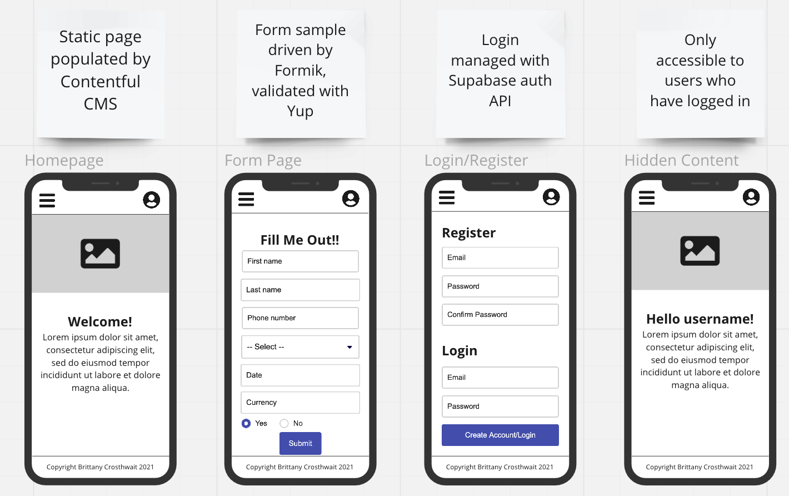

# React Website Demo

## Description

This project is archived.

This is a lighthearted, standalone demo website to showcase using a variety of user functionality and coding practices. See the 'Built With' section below to learn more about the technologies used.

## Built With

React  
Next.js (React framework)  
Node.js (JavaScript runtime)  
Vercel (deployment)  
PostgreSQL (database)  
Supabase (database host)  
Contentful (Content Management System)  
Miro (wireframe)  

## Wireframe

## Author

Brittany Crosthwait
